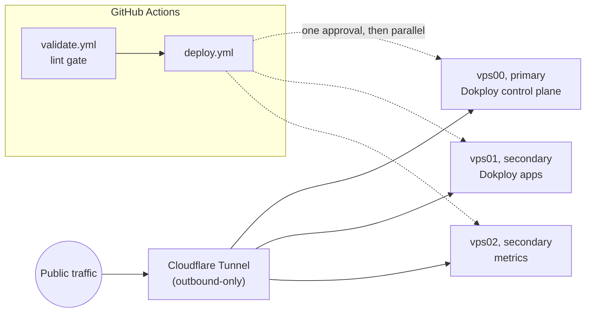

# homelab-but-the-home-is-silent

[](https://github.com/nineW0nW0n/homelab-but-the-home-is-silent/actions/workflows/validate.yml)
[](./LICENSE)

GitOps infrastructure for a 3-node Debian 12 VPS homelab: [Dokploy](https://dokploy.com)
as the deployment platform, Cloudflare Tunnel for public access with zero
inbound ports, GitHub Actions as the only path to production.

> [!NOTE]
> **Status: work in progress.** Nodes are provisioned, hardened, and
> deployable via CI. Dokploy, Cloudflare Tunnel and two workloads are
> live: `booking.maybeit.work` (EasyAppointments) and
> `budget.maybeit.work` (ezBookkeeping), both on vps01. Only the latter is
> backed up off-site so far. Expect rough edges. `main` is protected
> against force-push and deletion, so fixes land as new commits, not
> rewrites.

## 🗺️ Topology

| Node  | Role      | Notes                                                     |
|-------|-----------|-----------------------------------------------------------|
| vps00 | primary   | Dokploy control plane + own `cloudflared`                  |
| vps01 | secondary | Dokploy Remote Server, hosts both apps + own `cloudflared` |
| vps02 | secondary | Dokploy Remote Server, metrics only so far + own `cloudflared` |

All three also run Netdata (bound to loopback) and a Dokploy-installed
Traefik. Each node runs its **own single-node Swarm**: three independent
swarms, not one cluster.

2 vCPU / 2GB RAM each. Real IPs are never committed.
`infra/inventory.example.yaml` is the redacted template, usage examples in
`scripts/` use RFC 5737 documentation addresses (`203.0.113.x`), and a
pre-commit hook fails the commit if a routable address appears in a tracked
file. Note the `vps0N.maybeit.work` names are inventory labels with no DNS
records; they are not substitutes for an address.

vps01/vps02 are managed as Dokploy **Remote Servers**, not Swarm workers:
each node stays independent and hosts its own apps rather than pooling
resources, which fits three boxes this small a lot better than clustering
them.



## 🔒 Network model

> [!IMPORTANT]
> No node has an open inbound port except SSH (22). All public traffic
> (the Dokploy dashboard, deployed apps) arrives through Cloudflare
> Tunnel, which is outbound-only from each node's side.

**UFW alone does not deliver that**, and for a while this README claimed
it did while ports 80, 443 and 3000 answered from the internet. Docker
inserts its own `nat`/`DOCKER` rules that are evaluated *before* UFW's
chains, so every container-published port bypasses the firewall no matter
what `ufw status` says. Two layers close it, both applied by
`harden-node.sh`:

- a drop for all new inbound traffic on the WAN interface in
  `DOCKER-USER`, the one chain Docker will not rewrite, IPv4 and IPv6,
  reapplied at boot by a systemd unit ordered after `docker.service`;
- `"ip": "127.0.0.1"` in `/etc/docker/daemon.json`, so newly published
  ports do not land on `0.0.0.0` by default.

The second does not cover Swarm host-mode or ingress-mode publishes, which
is why both exist. The check that matters is a port sweep from off-node,
not `ufw status`.

Public hostnames that should not be public are behind **Cloudflare
Access**: the Dokploy dashboard and all three Netdata endpoints require
authentication at the edge, before the tunnel.

`cloudflared` runs in token mode (`tunnel run` + `TUNNEL_TOKEN`), and
public-hostname routing is configured in the Cloudflare Zero Trust
dashboard, not a file in this repo. `network_mode: host` is required on
every `cloudflared` service: bridge mode puts it in its own network
namespace, breaking `localhost:PORT` origin URLs.

**One tunnel token per node, never shared.** Cloudflare load-balances a
hostname's requests across every connector registered to its tunnel: a
route isn't pinned to a specific node. Two nodes sharing one token means
requests for either node's app can land on the wrong node and 502. Each
node that serves something gets its own tunnel and its own token.

**Not reachable from most of the world.** A zone-wide Cloudflare custom
rule blocks every request whose source country is not the Philippines,
across every hostname, with one exemption for the `maybeit.work` apex so
the status page is publicly readable. `booking` and `budget` are therefore
unreachable outside PH by design. Any non-PH client, including GitHub
Actions runners and the nodes themselves, gets a `403` that looks exactly
like an outage and is not one. The rule lives only in the Cloudflare
dashboard, so nothing in this repo can restore it.

All three Netdata agents are also **claimed into Netdata Cloud**, an
outbound HTTPS connection to a third party from every node. It opens no
inbound port, so the statement above still holds, but it is a dependency
worth naming next to a zero-inbound-ports posture.

## 📦 Repo layout

```
.yamllint, biome.json                strict lint config (YAML; JS/TS/JSON/CSS)
.pre-commit-config.yaml              enforced pre-commit + CI
.github/
  dependabot.yml                     weekly bumps for SHA-pinned actions + worker npm deps
  workflows/
    validate.yml                     pre-commit over the whole repo, reusable via workflow_call
    deploy.yml                       one approval, then all three nodes in parallel
    deploy-worker.yml                tests + deploys the status Worker
infra/
  inventory.example.yaml             redacted node IP template (real IPs stay gitignored)
stacks/
  vps0N/docker-compose.yml           per-node cloudflared connector + Netdata
  vps0N/netdata.conf, health.d/      loopback bind, tightened RAM/disk alert thresholds
  vps01/backup-ezbookkeeping.sh      nightly off-site backup to Cloudflare R2
  vps01/check-backup-age.sh          hourly staleness alert, straight to Telegram
dokploy/
  ezbookkeeping/, booking/           compose apps Dokploy clones from this repo itself
worker/status/                       Cloudflare Worker: maybeit.work status page + health poller
docs/superpowers/                    handoffs, plans and specs from past sessions
scripts/
  bootstrap-dokploy.sh               install Dokploy control plane (vps00 only)
  provision-deploy-user.sh           create the CI deploy user, key-only, rsync installed
  install-docker.sh                  Docker Engine from Docker's apt repo (no Dokploy)
  harden-node.sh                     UFW, key-only sshd, Fail2Ban, DOCKER-USER drops
  add-swap.sh                        swap file (these nodes ship with none)
  cap-dokploy-resources.sh           memory-cap Dokploy's own control plane
  setup-maintenance.sh               cap container logs and journald, weekly docker prune
```

Two deploy paths, one repo: `deploy.yml` rsyncs `stacks/` to the nodes and
never touches `dokploy/`, while Dokploy clones `dokploy/` itself from GitHub
and redeploys through a per-app webhook.

All scripts are idempotent, POSIX `sh`, shellcheck-clean, and safe to
re-run; most matter again if a node ever gets rebuilt from scratch.

## CI/CD

- `validate.yml` runs on every PR and push to `main`: pre-commit over all
  files: `yamllint --strict`, `actionlint`, `shellcheck`, `gitleaks`,
  `biome ci`, a no-real-IP check, trailing-whitespace, large-file and
  private-key checks.
- `deploy.yml` runs on push to `main` (paths: `infra/**`, `stacks/**`,
  `deploy.yml` itself) or
  manual dispatch. It calls `validate.yml` first (nothing deploys unless
  lint passes), then waits for a single **manual approval** on the
  `production` environment, after which all three nodes deploy in
  parallel. It was sequential until 2026-08-19; approving three per-job
  gates on every deploy was not worth the staged rollout on three nodes
  that are already independent. Per node: SSH in via
  `webfactory/ssh-agent` with that node's own key and a pinned
  `known_hosts`, `rsync --delete --exclude 'backup/'` the node's stack
  files (the exclude protects node-side state: the backup's run log and
  its last-success stamp), write that node's tunnel token and Netdata
  Cloud claim values to a remote `.env` over stdin plus separate
  `.r2.env` and `.telegram.env` credential files, then a guarded
  `docker compose pull && up -d`, guarded because a stack with no
  services defined makes plain `compose pull` error out otherwise.
- Each deploy job ends by verifying the node it just touched: Netdata
  answers on loopback, that node's `cloudflared` is running, and on vps01
  both apps answer through Traefik. The check runs on the node over the SSH
  connection the deploy already holds, because a zone-wide Cloudflare rule
  blocks every request from outside the Philippines, so probing the public
  hostnames fails from CI while the site is perfectly healthy. The edge and tunnel
  path is covered by the status page and Netdata Cloud instead. The check
  reports and fails; it never rolls back. A revert cannot undo node-side
  state, and an automated retry loop against three nodes with nobody awake
  is worse than an alert.
- Every action is pinned to a full commit SHA, not a tag. Tags are
  mutable, and these workflows run with SSH keys and a Cloudflare API
  token in scope. Dependabot bumps the pins weekly.

## 🧯 Security

- UFW: deny-all-incoming except SSH, on every node, plus `DOCKER-USER`
  drops, because UFW does not govern container-published ports (see
  [Network model](#-network-model)).
- sshd: key-only auth (`PasswordAuthentication no`, `UsePAM no`).
- Fail2Ban: aggressive sshd jail, `backend = systemd` (these images ship
  without rsyslog, so the default file-based jail backend has nothing to
  tail).
- Cloudflare Access in front of the Dokploy dashboard and every Netdata
  endpoint. The status Worker reaches them with a service token.
- One CI key **per node**, so a leaked Actions secret reaches one node
  rather than three, and deploys require a human approval.
- Netdata does not get the Docker socket. A `:ro` bind on a socket
  restricts nothing: anything that can reach the Docker API can start a
  container with the host filesystem mounted.
- Dokploy manages the other nodes over its own separate, dedicated SSH
  credential, scoped to that purpose only.
- A zone-wide Cloudflare rule blocks all non-Philippines traffic, and all
  three Netdata agents stream outbound to Netdata Cloud (see
  [Network model](#-network-model)). Both live outside this repo: the geo
  rule in the Cloudflare dashboard, the Cloud claim in a GitHub secret.

> [!NOTE]
> The CI deploy user has no sudo, but that is a smaller guarantee than it
> sounds: it is in the `docker` group and owns the compose files, so it
> can have root run whatever it writes. Any path that lets CI deploy
> containers is root-equivalent by construction. The controls that
> actually bound this are the per-node keys and the approval gate, not
> the absence of sudo.

## 💾 Backups

`budget.maybeit.work`'s data (a SQLite database plus uploaded receipt
images) is archived nightly at 03:00 Asia/Manila to a Cloudflare R2 bucket.
The app container is stopped for the few seconds the archive takes, so
SQLite checkpoints its write-ahead log and the copy is provably consistent;
a shell trap starts it again even when the backup fails, because
availability outranks the backup.

Retention lives in R2 lifecycle rules rather than in the script: `daily/`
expires after 7 days, `weekly/` after 28. Deletion is server-side, so a bug
in the script cannot erase history.

Staleness is alerted by `check-backup-age.sh`: an hourly cron job that reads
the same stamp file the backup writes and calls the Telegram API directly.
First alert at 36 hours, re-alert every 12 hours while stale, one message on
recovery. **It deliberately does not go through Netdata.** A Netdata alarm
charts the same age for the dashboard, but its notifications are not a proven
delivery path and nothing depends on them.

A backup that is never restored is a guess, so the restore path is drilled by
hand: pull the newest archive, extract it into throwaway volumes, boot a
second container against them, then delete all of it. That drill is what
caught the schedule silently never firing.

`booking.maybeit.work`'s MySQL volume is not covered yet.

## Resource constraints

Two vCPU, 2GB RAM, no swap by default: small enough that an unbounded
container can take the whole node down, not just itself.

- `add-swap.sh` provisions a 2GB swapfile (`vm.swappiness=10`) on every
  node, so a transient memory spike during app startup or a DB migration
  degrades instead of triggering a hard OOM-kill.
- Every app service (in this repo's `stacks/` or deployed through
  Dokploy) gets an explicit `mem_limit`/`mem_reservation`. Deliberately
  the classic Compose key, not `deploy.resources`, which is Swarm-oriented
  and isn't reliably honored by plain `docker compose up`, the command
  both `deploy.yml` and Dokploy actually run.
- Dokploy's own control plane was uncapped by default, consuming a
  disproportionate share of a small node's memory on its own before
  `cap-dokploy-resources.sh` bounded it.

## License

[AGPLv3](./LICENSE).

## Credits

Built by [nineW0nW0n](https://github.com/nineW0nW0n), with
[Claude Code](https://claude.com/claude-code) doing a lot of the typing.
