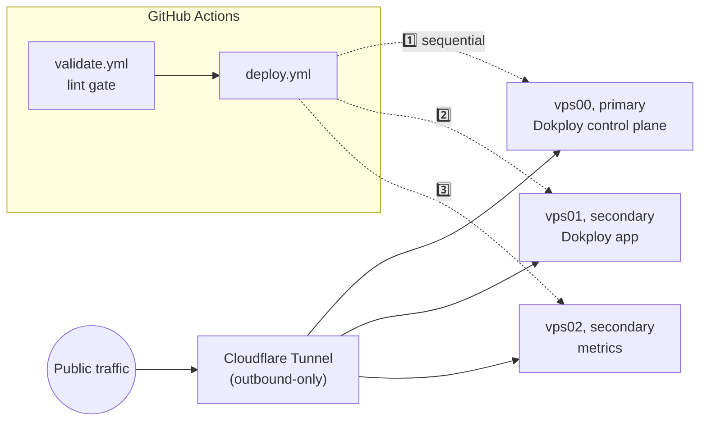

# homelab-but-the-home-is-silent

[](https://github.com/nineW0nW0n/homelab-but-the-home-is-silent/actions/workflows/validate.yml)
[](./LICENSE)

GitOps infrastructure for a 3-node Debian 12 VPS homelab: [Dokploy](https://dokploy.com)
as the deployment platform, Cloudflare Tunnel for public access with zero
inbound ports, GitHub Actions as the only path to production.

> [!NOTE]
> **Status: work in progress.** Nodes are provisioned, hardened, and
> deployable via CI. Dokploy, Cloudflare Tunnel and the first workload
> are live. Expect rough edges. `main` is protected against force-push
> and deletion, so fixes land as new commits, not rewrites.

## 🗺️ Topology

| Node  | Role      | Notes                                                     |
|-------|-----------|-----------------------------------------------------------|
| vps00 | primary   | Dokploy control plane + own `cloudflared`                  |
| vps01 | secondary | Dokploy Remote Server, hosts the app + own `cloudflared`   |
| vps02 | secondary | Dokploy Remote Server, metrics only so far + own `cloudflared` |

All three also run Netdata (bound to loopback) and a Dokploy-installed
Traefik. Each node runs its **own single-node Swarm**: three independent
swarms, not one cluster.

2 vCPU / 2GB RAM each. Real IPs are never committed.
`infra/inventory.example.yaml` is the redacted template, usage examples in
`scripts/` use RFC 5737 documentation addresses (`203.0.113.x`), and a
pre-commit hook fails the commit if a routable address appears in a tracked
file. Note the `vps0N.maybeit.work` names are inventory labels with no DNS
records; they are not substitutes for an address.

vps01/vps02 are managed as Dokploy **Remote Servers**, not Swarm workers:
each node stays independent and hosts its own apps rather than pooling
resources, which fits three boxes this small a lot better than clustering
them.



## 🔒 Network model

> [!IMPORTANT]
> No node has an open inbound port except SSH (22). All public traffic
> (the Dokploy dashboard, deployed apps) arrives through Cloudflare
> Tunnel, which is outbound-only from each node's side.

**UFW alone does not deliver that**, and for a while this README claimed
it did while ports 80, 443 and 3000 answered from the internet. Docker
inserts its own `nat`/`DOCKER` rules that are evaluated *before* UFW's
chains, so every container-published port bypasses the firewall no matter
what `ufw status` says. Two layers close it, both applied by
`harden-node.sh`:

- a drop for all new inbound traffic on the WAN interface in
  `DOCKER-USER`, the one chain Docker will not rewrite, IPv4 and IPv6,
  reapplied at boot by a systemd unit ordered after `docker.service`;
- `"ip": "127.0.0.1"` in `/etc/docker/daemon.json`, so newly published
  ports do not land on `0.0.0.0` by default.

The second does not cover Swarm host-mode or ingress-mode publishes, which
is why both exist. The check that matters is a port sweep from off-node,
not `ufw status`.

Public hostnames that should not be public are behind **Cloudflare
Access**: the Dokploy dashboard and all three Netdata endpoints require
authentication at the edge, before the tunnel.

`cloudflared` runs in token mode (`tunnel run` + `TUNNEL_TOKEN`), and
public-hostname routing is configured in the Cloudflare Zero Trust
dashboard, not a file in this repo. `network_mode: host` is required on
every `cloudflared` service: bridge mode puts it in its own network
namespace, breaking `localhost:PORT` origin URLs.

**One tunnel token per node, never shared.** Cloudflare load-balances a
hostname's requests across every connector registered to its tunnel: a
route isn't pinned to a specific node. Two nodes sharing one token means
requests for either node's app can land on the wrong node and 502. Each
node that serves something gets its own tunnel and its own token.

## 📦 Repo layout

```
.yamllint, biome.json                strict lint config (YAML; JS/TS/JSON/CSS)
.pre-commit-config.yaml              enforced pre-commit + CI
.github/
  dependabot.yml                     weekly bumps for SHA-pinned actions + worker npm deps
  workflows/
    validate.yml                     pre-commit over the whole repo, reusable via workflow_call
    deploy.yml                       sequential rolling deploy: vps00 -> vps01 -> vps02
    deploy-worker.yml                tests + deploys the status Worker
infra/
  inventory.example.yaml             redacted node IP template (real IPs stay gitignored)
stacks/
  vps0N/docker-compose.yml           per-node cloudflared connector + Netdata
  vps0N/netdata.conf, health.d/      loopback bind, tightened RAM/disk alert thresholds
worker/status/                       Cloudflare Worker: maybeit.work status page + health poller
scripts/
  bootstrap-dokploy.sh               install Dokploy control plane (vps00 only)
  provision-deploy-user.sh           create the CI deploy user, key-only, rsync installed
  install-docker.sh                  Docker Engine from Docker's apt repo (no Dokploy)
  harden-node.sh                     UFW, key-only sshd, Fail2Ban, DOCKER-USER drops
  add-swap.sh                        swap file (these nodes ship with none)
  cap-dokploy-resources.sh           memory-cap Dokploy's own control plane
```

All scripts are idempotent, POSIX `sh`, shellcheck-clean, and safe to
re-run; most matter again if a node ever gets rebuilt from scratch.

## CI/CD

- `validate.yml` runs on every PR and push to `main`: pre-commit over all
  files: `yamllint --strict`, `actionlint`, `shellcheck`, `gitleaks`,
  `biome ci`, a no-real-IP check, trailing-whitespace, large-file and
  private-key checks.
- `deploy.yml` runs on push to `main` (paths: `infra/**`, `stacks/**`) or
  manual dispatch. It calls `validate.yml` first (nothing deploys unless
  lint passes), then waits for a **manual approval** on the `production`
  environment, then runs three sequential jobs, never in parallel, so a
  bad deploy can't take all three nodes down at once. Per node: SSH in via
  `webfactory/ssh-agent` with that node's own key and a pinned
  `known_hosts`, `rsync --delete` the node's stack files, write that
  node's tunnel token to a remote `.env` over stdin, then a guarded
  `docker compose pull && up -d`, guarded because a stack with no
  services defined makes plain `compose pull` error out otherwise.
- Every action is pinned to a full commit SHA, not a tag. Tags are
  mutable, and these workflows run with SSH keys and a Cloudflare API
  token in scope. Dependabot bumps the pins weekly.

## 🧯 Security

- UFW: deny-all-incoming except SSH, on every node, plus `DOCKER-USER`
  drops, because UFW does not govern container-published ports (see
  [Network model](#-network-model)).
- sshd: key-only auth (`PasswordAuthentication no`, `UsePAM no`).
- Fail2Ban: aggressive sshd jail, `backend = systemd` (these images ship
  without rsyslog, so the default file-based jail backend has nothing to
  tail).
- Cloudflare Access in front of the Dokploy dashboard and every Netdata
  endpoint. The status Worker reaches them with a service token.
- One CI key **per node**, so a leaked Actions secret reaches one node
  rather than three, and deploys require a human approval.
- Netdata does not get the Docker socket. A `:ro` bind on a socket
  restricts nothing: anything that can reach the Docker API can start a
  container with the host filesystem mounted.
- Dokploy manages the other nodes over its own separate, dedicated SSH
  credential, scoped to that purpose only.

> [!NOTE]
> The CI deploy user has no sudo, but that is a smaller guarantee than it
> sounds: it is in the `docker` group and owns the compose files, so it
> can have root run whatever it writes. Any path that lets CI deploy
> containers is root-equivalent by construction. The controls that
> actually bound this are the per-node keys and the approval gate, not
> the absence of sudo.

## Resource constraints

Two vCPU, 2GB RAM, no swap by default: small enough that an unbounded
container can take the whole node down, not just itself.

- `add-swap.sh` provisions a 2GB swapfile (`vm.swappiness=10`) on every
  node, so a transient memory spike during app startup or a DB migration
  degrades instead of triggering a hard OOM-kill.
- Every app service (in this repo's `stacks/` or deployed through
  Dokploy) gets an explicit `mem_limit`/`mem_reservation`. Deliberately
  the classic Compose key, not `deploy.resources`, which is Swarm-oriented
  and isn't reliably honored by plain `docker compose up`, the command
  both `deploy.yml` and Dokploy actually run.
- Dokploy's own control plane was uncapped by default, consuming a
  disproportionate share of a small node's memory on its own before
  `cap-dokploy-resources.sh` bounded it.

## License

[AGPLv3](./LICENSE).

## Credits

Built by [nineW0nW0n](https://github.com/nineW0nW0n), with
[Claude Code](https://claude.com/claude-code) doing a lot of the typing.
